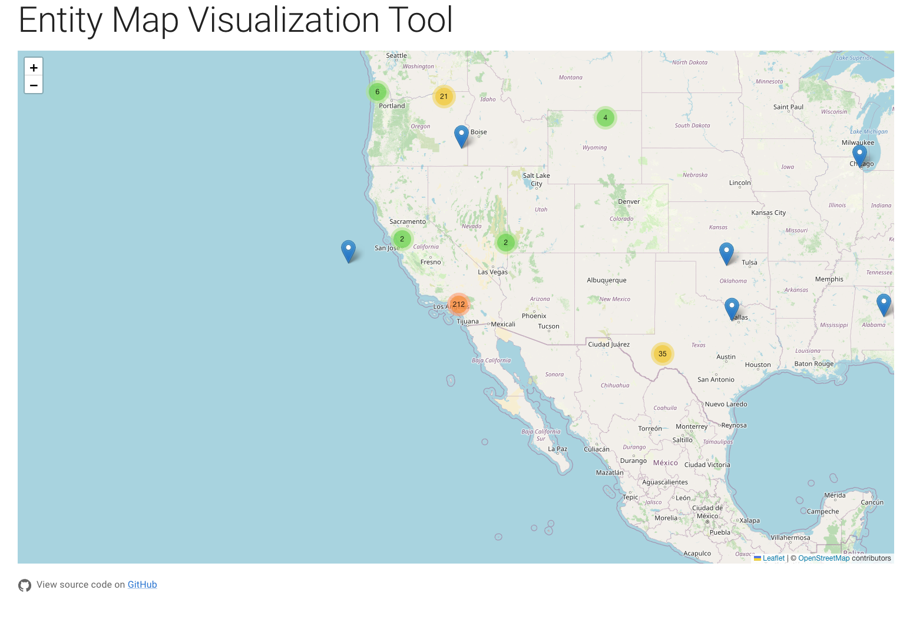
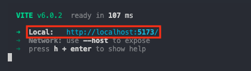

# Entity Map Visualizer



## Description

This sample application shows how to use the Lattice gRPC SDK for Javascript to display Entity position's as markers on a map. It uses the following dependencies to achieve this:


* `Connect RPC` - To make the gRPC+Web requests
* `Material UI` - For styling and basic components
* `React` - UI Framework
* `React Leaflet` - A React wrapper around the [Leaflet](https://leafletjs.com/) open-source Javascript map library
* `React Leaflet MarkerCluster` - Clusters Leaflet markers. 

## How to run locally

### Pre-Requisites

This sample app requires that you have:

* [NodeJS](https://nodejs.org/en/download)

### Clone the repository

```bash
git clone https://github.com/anduril/sample-app-entity-visualizer
cd sample-app-entity-visualizer
```

### Edit variables

You now need to provide the sample application with the endpoint to get data from. To do so please create a `.env` file at the root of this project folder and populate it with:

```bash
VITE_ENVIRONMENT_TOKEN=""
VITE_SANDBOX_TOKEN=""
VITE_LATTICE_URL=""
```

Please contact your Anduril representative if you need assistance with populating these values.

### Run the application

```bash
npm install
npm run dev
```

In the terminal window, open the local link to view the application. You should now see the application in your web browser.



## Learn More

To learn more about the Lattice SDK, please visit our [documentation site](https://docs.anduril.com).

## Support

For support with this library please file an issue or reach out to your Anduril representative.
